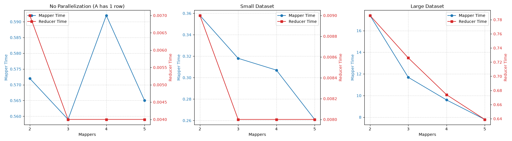

# Idea
Since MapReduce is not available, we emulate it's working, by writing to temporary files. Each mapper instance writes to its own file, and reads from its own input file.

Then the reducer reads all the files and combines them into one matrix.

When writing a matrix to a file, it is formatted as key-value pairs, where each key is the rowID and the value is the list of elements in that row: \
<row1, [elements of row1]> \
<row1, [elements of row2]> \
...

# Running
For a basic test, navigate to test/ and run: `cd test; ./run.sh` \
To benchmark, navigate to benchmark/ and run: `cd benchmark; ./benchmark`

# Correctness
`verify.py` calculates the product sequentially, then compares it to the `out` file. After all tests, the verification was done by running `python verify.py` in the directory where A, B, and out are present.

# Performance

## Edgecase: 1xM x MxN
In this situation, only 1 mapper is ever used. Thus, increasing the number of mappers should only add greater overhead, and no speedup.
Indeed, that is what the test results show:
|Mappers|Mapper Time|Reducer Time|Total Time|
|---|---|---|---|
|2|.572|.007|.585|
|3|.559|.004|.569|
|4|.592|.004|.601|
|5|.565|.004|.576|

## Divisibility of Number of Rows
| Mappers | Mapper Time | Reducer Time | Total Time |
| --- | --- | --- | --- |
| 2 | .460 | .007 | .472 |
| 3 | .420 | .007 | .431 |
| 4 | .452 | .010 | .467 |
| 5 | .405 | .007 | .418 |

In this example, the number of rows is 1662, which is divisible by 2 and 3, but not 4 and 5. At first glance it seems like that's the reason for a spike in time taken for 4, but note that 5 should then also take more time.

The difference in number of rows between mappers, when we have 4 mappers, is at most 1.
This is dwarfed by the difference in number of rows between 4 and 5 mappers.
Thus the divisibility of number of rows does not affect the time in any meaningful way.

## Number of Mappers

At small input sizes, there is small yet noticeable speedup with more Mappers, and at larger sizes, the speedup is effectively linear.

Note: Initially, we were simply queueing the sbatch jobs in one go for all mapper sizes. This resulted in an unexpected slowdown, because each process was reading from and writing to the same files. \
This was fixed by simply running the tests one by one, and waiting for each one to finish before starting the next one.

Note that the Y-axis for reducer time is much more zoomed in, and therefore gives the appearance of a great speedup, even though the difference is very small.
